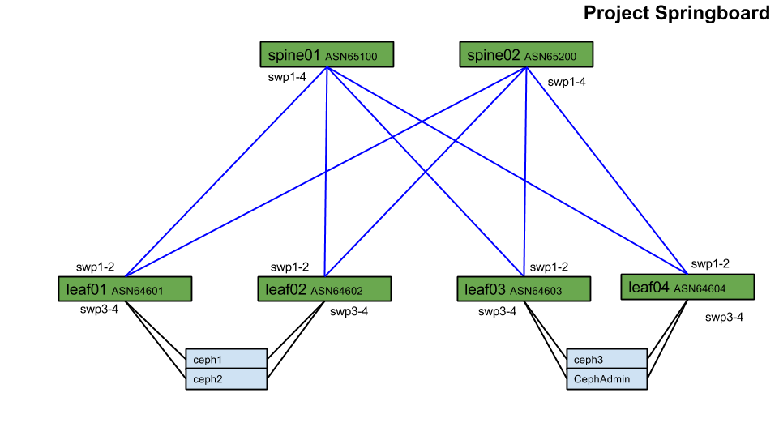

# Project-Springboard
This is an example datacenter deployment with [Docker](http://www.docker.com) containers and [Mesosphere](http://www.mesosphere.com/) for container management. For file storage the [Ceph](http://www.ceph.com) distributed IP based storage is used.

To provide announcements to the network of the availability of new containers, Quagga has been containerized and deployed on the Docker hosts. 

To provide resiliency and ECMP without proprietary technologies [Quagga](www.nongnu.org/quagga/) is deployed on the ceph nodes. 

#Diagrams:

Shared Google Drawing
https://docs.google.com/a/cumulusnetworks.com/drawings/d/1KI-OqsfdOIpu6VPe08vRmlXAG1H8IR8B3Yq2-JGpLp0/edit?usp=sharing

#Routing
Server to leaf and leaf to spine routing utilize eBGP. 

The [BGP unnumbered](https://docs.cumulusnetworks.com/display/DOCS/Configuring+Border+Gateway+Protocol+-+BGP#ConfiguringBorderGatewayProtocol-BGP-unnumberedUsingBGPUnnumberedInterfaces) feature is used so that no IP addresses are required for any infrastructure links.

Ceph servers announce loopback IP addresses to the leafs.
Docker hosts announce container IP addresses to the leafs.

The leafs announce default routes to both the Ceph and Docker hosts, allowing for full load sharing. 

#Files
- spines.yml: This is the Ansible configuration definition to deploy spine nodes
- leafs.yml: This is the Ansible configuration definition to deploy leaf nodes
- ceph.yml: This is the Ansible configuration definition to deploy ceph hosts
- Vagrantfile: This is the Vagrant configuration definition to build the virtual network and virtual machine parameters
- packages (directory): This contains the Debian packages that are installed on the hosts to install Quagga. This is to provide an offline method for provisioning hosts. 
- ansible.cfg: The configuration file for ansible settings 